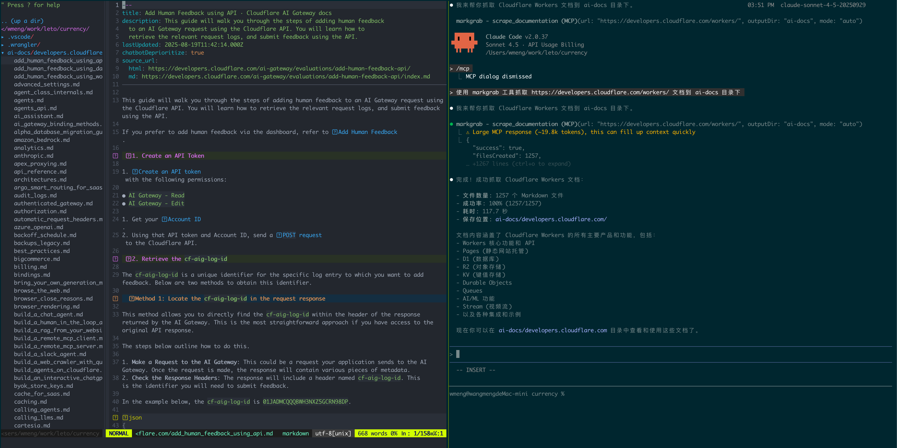

# markgrab

[English](./README-en.md) | 简体中文



使用 `Claude Code` 或者 `Codex` 开发功能时，经常会因为没有准确的文档而导致要么没有使用最优雅的方式实现，要么乱编API。

而针对 `Claude Code` 最好的方式是把文档完整的放到项目某个目录下，告诉AI地址，让它自己去查。

所以我经常做的事情就是去网站上复制文档到项目目录下，叫AI去参考然后开始规划写代码。Markgrab 就是把这种行为自动化了，并且支持 MCP ，告诉AI文档URL，AI会自动尝试抓取指定URL并且转换成Markdown并保存。

## ✨ 核心特性

- 🤖 **智能抓取**: 自动检测 [llms.txt](https://llmstxt.org) 或使用 CSS 选择器
- ⚡ **高性能**: 并发抓取 + 进度显示 + 自动重试
- 📝 **原生 Markdown**: 优先获取 `.md` 源文件，失败自动转换 HTML
- 🎯 **三种模式**: 自动选择 llms.txt / 跟随链接 / 单页模式
- ⚙️ **灵活配置**: 支持 TOML 配置文件和命令行参数

## 安装

### 前置要求

本工具基于 [Bun](https://bun.sh) 运行时构建，使用前需要先安装 Bun：

```bash
# macOS / Linux / WSL
curl -fsSL https://bun.sh/install | bash

# Windows (PowerShell)
powershell -c "irm bun.sh/install.ps1|iex"
```

### 使用方式

#### 使用MCP (推荐)
```bash
# 例如 claude code
# 配置mcp
claude mcp add --transport stdio markgrab --scope user -- npx markgrab mcp
```

#### 命令行使用 npx

无需安装，直接运行：

```bash
npx markgrab --url=https://bun.com/docs
```


## 快速开始

```bash
# 最简单的用法 - 抓取单页
npx markgrab --url=https://bun.com/docs/installation

# 自动检测 llms.txt - 抓取整站（推荐）
npx markgrab --url=https://bun.com/docs

# 使用 CSS 选择器 - 抓取多页
npx markgrab --url=https://bun.com/docs --follow='a[href^="/docs/"]'
```

## 使用指南

### 基础用法

```bash
markgrab --url=<url> [选项]
# 或使用 npx
npx markgrab --url=<url> [选项]
```

**常用选项：**

| 选项 | 说明 | 示例 |
|------|------|------|
| `--url=<url>` | 要抓取的 URL（必需） | `--url=https://bun.com/docs` |
| `--follow=<selector>` | CSS 选择器，跟随链接抓取 | `--follow='nav a'` |
| `--content=<selector>` | 内容区域选择器（默认 `body`） | `--content=main` |
| `--output=<dir>` | 输出目录（默认 `./`） | `--output=./docs` |
| `--dry-run` | 预览模式，不实际抓取 | - |
| `--config=<path>` | 配置文件路径 | `--config=config.toml` |

**高级选项：**

| 选项 | 说明 |
|------|------|
| `--no-native-md` | 禁用原生 Markdown，强制 HTML 转换 |
| `--no-llms-txt` | 禁用 llms.txt 自动检测 |
| `--include-optional` | 包含 llms.txt 中的 Optional 部分 |
| `--help`, `-h` | 显示帮助信息 |


## 常见问题

### 如何查看将要抓取什么？

使用 `--dry-run` 预览：

```bash
markgrab --url=https://bun.com/docs --dry-run
```

### 如何只抓取主要内容区域？

使用 `--content` 指定选择器：

```bash
markgrab --url=https://example.com --content=article
```

### 如何抓取整个文档站点？

使用 `--follow` 指定链接选择器：

```bash
markgrab --url=https://bun.com/docs --follow='a[href^="/docs/"]'
```

### 文件保存在哪里？

默认保存到 `<output>/<域名>/` 目录下，例如：

- 输出目录: `./` (默认)
- URL: `https://bun.com/docs/installation`
- 保存位置: `./bun.com/installation.md`
